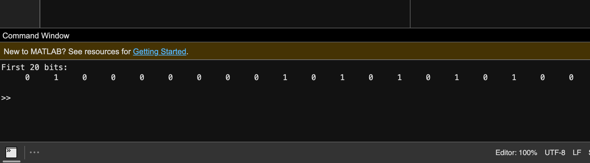
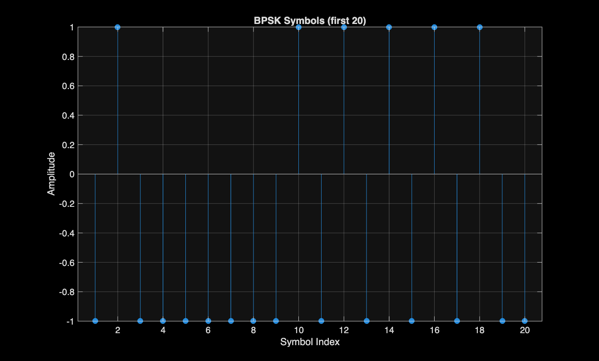
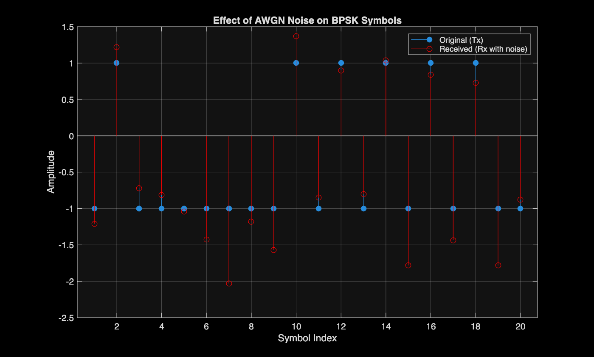
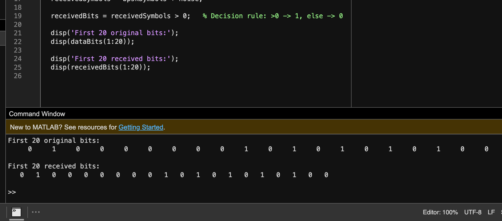
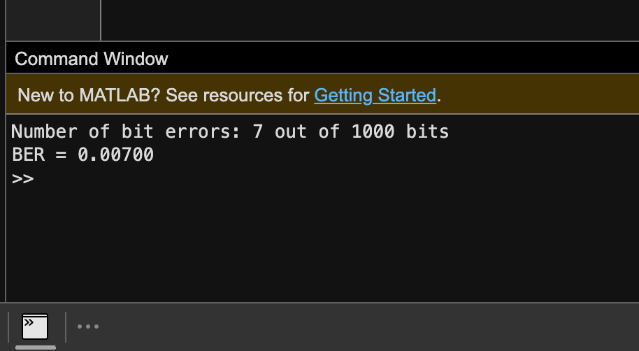
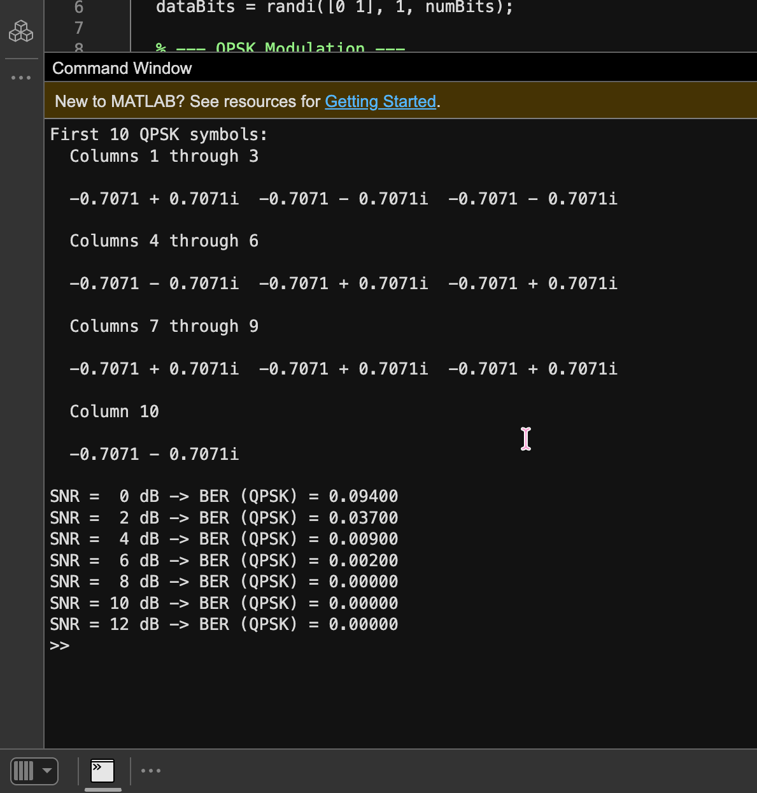
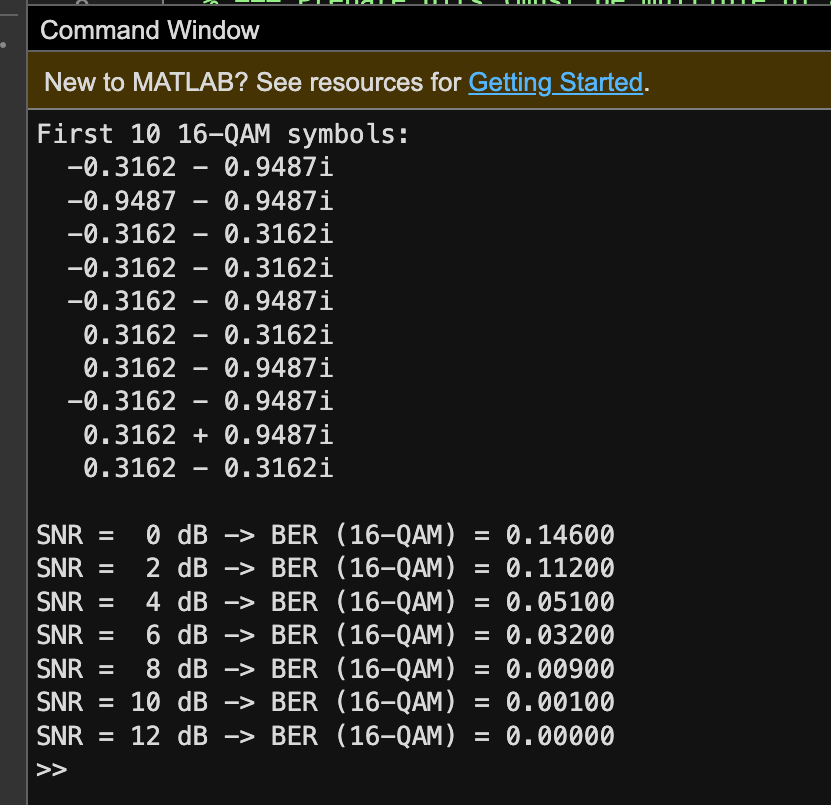

# Performance-Analysis-of-Digital-Modulation-Techniques-over-AWGN-Channel
A step-by-step MATLAB simulation of a complete digital communication system — built from scratch to study how noise (AWGN) affects three digital modulation techniques: **BPSK**, **QPSK**, and **16-QAM**.

Each stage of the system (data generation, modulation, noise, demodulation, BER, and analysis) is implemented as an independent, runnable MATLAB script — making it easy to follow the full pipeline one step at a time.

---

## 🎯 Objective

To build an end-to-end digital communication system and analyze how noise impacts different modulation schemes, using standard performance metrics: **Bit Error Rate (BER)**, **Constellation Diagrams**, and **Frequency Spectrum (FFT)**.

---

## 🛠️ Tools Used

- **MATLAB** 
- No external toolboxes — every function (modulation, AWGN channel, demodulation, BER) is implemented manually

---

## 📂 Repository Structure

```
digital-modulation-awgn/
├── Stage1_GenerateData.m
├── Stage2_BPSK_Modulation.m
├── Stage3_AWGN_Channel.m
├── Stage4_Receiver_Demodulation.m
├── Stage5_BER_Calculation.m
├── Stage6_SNR_Loop_BPSK.m
├── Stage7_QPSK_Full.m
├── Stage8_16QAM_Full.m
├── Stage9_Combined_BER_Plot.m
├── Stage10_Constellation_Diagrams.m
├── Stage11_FFT_Spectrum.m
├── figures/
│   ├── stage1_random_bits.png
│   ├── Stage2_BPSK_Symbols.png
│   ├── Stage3_AWGN_Effect.png
│   ├── stage4_receiver_bits.png
│   ├── stage5_ber_calculation.png
│   ├── Stage6_BER_vs_SNR_BPSK.png
│   ├── stage7_qpsk_results.png
│   ├── stage8_16qam_results.png
│   ├── BER_vs_SNR.png
│   ├── Constellation_Comparison.png
│   └── Spectrum_Comparison.png
└── README.md
```

> Each script runs independently (`rng(1)` is used for reproducible results) — no need to run them in order for the code to work, but running in order follows the natural build-up of the system.

---

## 🧩 System Pipeline

```
Random Bits → Modulation (BPSK / QPSK / 16-QAM) → AWGN Channel → Demodulation → BER Calculation → SNR Sweep → Analysis
```

---

## 📊 Stages & Results

### Stage 1 — Generate Random Data
`Stage1_GenerateData.m`



*Randomly generated binary data representing the message to be transmitted (first 20 bits shown as a sample).*

---

### Stage 2 — BPSK Modulation
`Stage2_BPSK_Modulation.m`



*BPSK modulation: each bit is mapped to a symbol of +1 or −1.*

---

### Stage 3 — AWGN Channel
`Stage3_AWGN_Channel.m`



*Effect of Additive White Gaussian Noise (AWGN) on the transmitted BPSK signal at SNR = 5 dB — comparing the original and received symbols.*

---

### Stage 4 — Receiver (Demodulation)
`Stage4_Receiver_Demodulation.m`



*Receiver output after hard-decision demodulation, comparing the original transmitted bits with the received bits.*

---

### Stage 5 — BER Calculation
`Stage5_BER_Calculation.m`



*Bit Error Rate (BER) calculated by comparing the original and received bit sequences.*

---

### Stage 6 — BPSK BER across Multiple SNR Values
`Stage6_SNR_Loop_BPSK.m`


*BER of BPSK evaluated across a range of SNR values (0–12 dB), showing BER decreasing as SNR increases.*

---

### Stage 7 — QPSK: Full Pipeline
`Stage7_QPSK_Full.m`



*Complete QPSK simulation — modulation, AWGN channel, demodulation, and BER computed across SNR values.*

---

### Stage 8 — 16-QAM: Full Pipeline
`Stage8_16QAM_Full.m`



*Complete 16-QAM simulation — modulation, AWGN channel, demodulation, and BER computed across SNR values.*

---

### Stage 9 — Combined BER vs SNR (Final Comparison)
`Stage9_Combined_BER_Plot.m`


*Final BER vs SNR comparison for BPSK, QPSK, and 16-QAM, simulated with 100,000 bits for high accuracy.*

BPSK and QPSK perform almost identically (as expected theoretically), while 16-QAM shows a clearly higher BER at the same SNR due to its denser symbol constellation.

---

### Stage 10 — Constellation Diagrams
`Stage10_Constellation_Diagrams.m`


*Constellation diagrams for BPSK, QPSK, and 16-QAM under AWGN noise (SNR = 10 dB).*

As modulation order increases, symbol points move closer together — making the system more sensitive to noise, which visually explains the higher BER of 16-QAM.

---

### Stage 11 — Spectrum Comparison (FFT)
`Stage11_FFT_Spectrum.m`


*Frequency spectrum comparison of BPSK, QPSK, and 16-QAM signals.*

Higher-order modulation schemes transmit more bits per symbol, requiring fewer symbols for the same data — resulting in more efficient bandwidth usage.

---

## 🧠 Key Conclusions

| Question | Answer |
|---|---|
| Which technique has the lowest BER? | **BPSK** — largest distance between symbol points, most robust to noise |
| Which technique needs the highest SNR for reliable transmission? | **16-QAM** — closely spaced symbols are more vulnerable to noise |
| Why is BPSK more resistant to noise? | Only 2 symbol states with maximum separation (−1, +1) |
| Why is 16-QAM still widely used despite higher BER? | It transmits 4 bits/symbol, giving much higher data rates and better bandwidth efficiency |

**Trade-off:** Digital communication systems balance **data rate** against **noise robustness** — higher-order modulation (16-QAM) sends more data per symbol but needs a higher SNR to achieve the same reliability as simpler schemes (BPSK/QPSK).

---

## ▶️ How to Run

1. Download or clone this repository.
2. Open MATLAB (or [MATLAB Online](https://matlab.mathworks.com/)).
3. Open any `StageX_*.m` file and click **Run** — each script is fully self-contained.
4. Recommended order for a full walkthrough: `Stage1` → `Stage11`.

---

## 📚 Concepts Covered

- Digital modulation (BPSK, QPSK, 16-QAM)
- AWGN channel modeling (Eb/N0-based noise generation)
- Hard-decision demodulation
- Bit Error Rate (BER) analysis
- Constellation diagrams
- Frequency-domain (FFT) analysis
- SNR vs. performance trade-offs in digital communication systems

---

## ✍️ Author

**Bushra** — Electrical Engineering Graduate
Focus areas: Power Systems, Automation & Control, Embedded Systems & Signal Processing
